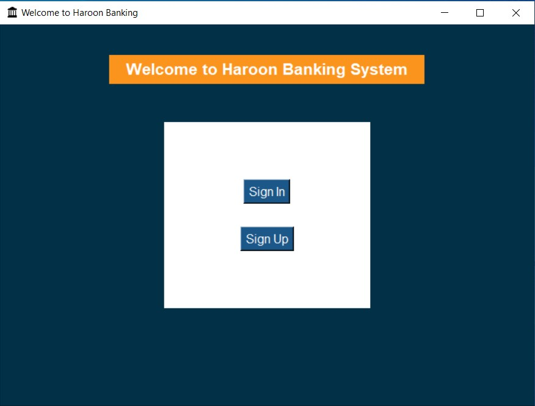

# Bank Management System

This Python-based application offers an intuitive and visually appealing platform for managing your bank accounts. Designed with a sleek **Tkinter GUI**, users can easily sign in, register new accounts, manage profiles, perform transactions, and view account details, all in a user-friendly interface. Whether you're checking your balance, making deposits or transfers, or reviewing your transaction history, this system provides a seamless and interactive banking experience.


<div align="center">
  
</div>


## Features

- **Sign In / Sign Up**
  - Check if User is Registered
  - No User Registration

- **Account Management**
  - Same Account
    - Credit / Withdraw
    - Send Money to Another Account
  - Account Details Update
  - Transaction History

- **Banking Facilities**
  - Account Details
  - Registration
  - Account Management
  - Transaction History
  - Balance Enquiry
  - Credit / Withdraw
  - Funds Transfer
  - Date/Time Functions
  - OOPs Implementation
  - Delete Account
  - Separate Account Number

## Getting Started

### Prerequisites

Ensure you have Python installed on your system. You can download it from [python.org](https://www.python.org/downloads/).

### Installation
1. Install MySQL Connector:
    ```bash
    pip install mysql-connector-python
    ```
2. Clone the repository:
    ```bash
    git clone https://github.com/haroon-sajid/Python-Bank-Project
    ```
3. Navigate to the project directory:
    ```bash
    cd Python-Bank-Project
    ```

### Usage
1. Run the Database File Once to Create Required Tables:
    ```bash
    python database.py
    ```
2. Run the application:
    ```bash
    python main.py
    ```
3. Follow the on-screen instructions to navigate through the menu and use the various features of the bank management system.

## Detailed Features

### Registration

- New users can register by providing personal details and creating an account.

### Sign In / Sign Up

- Users can sign in using their account credentials.
- New users can sign up and create a new account.

### Account Management

- Update account details.
- View the transaction history.
- Enquire about account balance.

### Transactions

- Credit or withdraw money from the account.
- Transfer funds to another account.

### Banking Facilities

- Provides various banking functionalities like balance enquiry, funds transfer, and viewing transaction history.
- Implements object-oriented programming (OOP) for better code management and scalability.
- Each account has a unique account number.

### Date/Time Functions

- Utilizes date and time functions to keep track of transactions and account activities.

## Contributing

We welcome contributions to enhance the features and improve the system. Feel free to fork the repository and create a pull request with your changes.

## License

This project is licensed under the MIT License - see the [LICENSE](LICENSE) file for details.

## Contact


Thank you for using the Bank Management System! I hope it helps you manage your bank accounts effectively.
